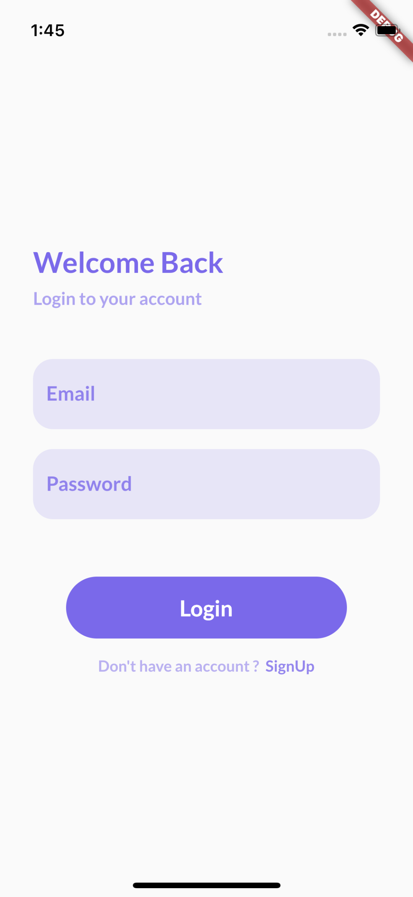
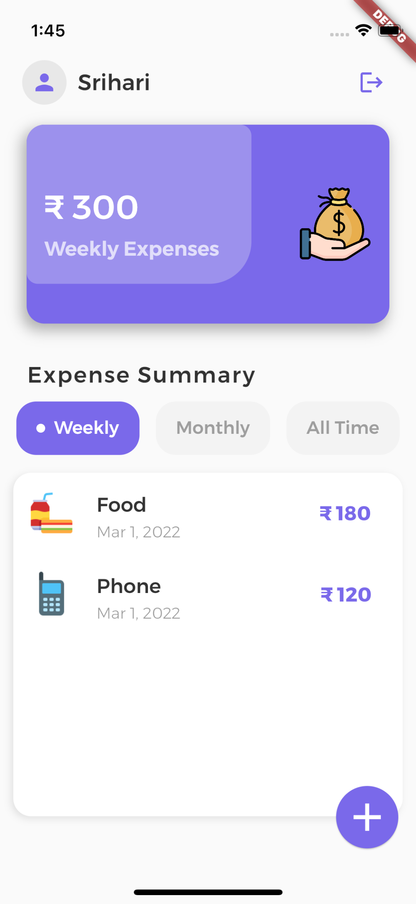
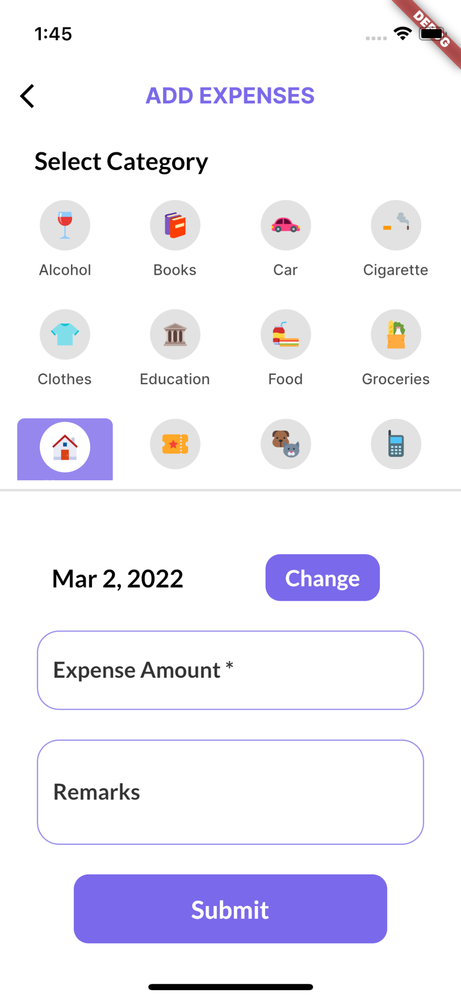
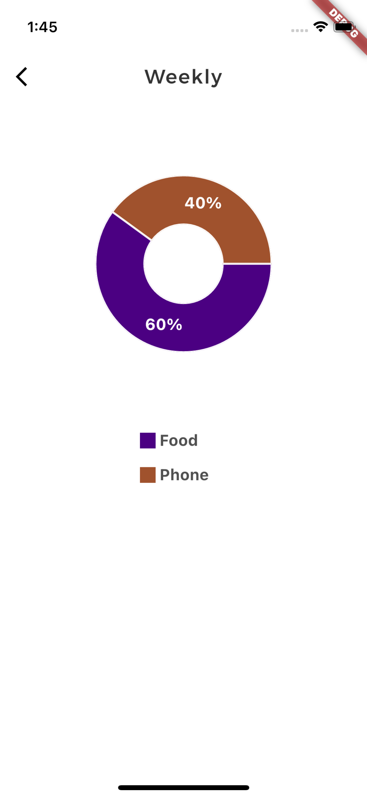

<p align="center">
  


</p>
<h3 align="center">MoneyBoi</h3>

<p align="center">
  MoneyBoi is an expense tracker app made with Flutter.
</p>

##

<p>
  Moneyboi uses a backend made using Node js and Express with MongoDb as database solution. The code for it can be found <a href="https://github.com/srihariash999/moneyboi_backend">here.</a>
 </p>

## Tech Stack:

- Flutter
- Dart

## Features:

This project is still in development stage. So, feature requests are welcome. Feel free to open an issue if you have something in mind or if something is not working right. it might make a large impact 💓

- [x] List expenses Daily, weekly, monthly.
- [x] Add new expense of certain category.
- [x] View expenses in a pie chart form.
- [x] Login, signup, forgot password flows.
- [x] Dark Mode
- [ ] Profile section and its features
- [ ] Custom month dates setup and view

## How to setup locally ?

1. Fork the repo.

2. Clone the repo using the forked repo.

3. Open the code in your favorite code editor.

4. Create a file `secrets.dart` and place it in `lib/Constants`. Create a string variable inside this file with name `baseUrl` containing the url of the moneyboi backend.

5. Install the dependencies using the following command:

    ```
    $ flutter pub get
    ```

6. Run the app in debug mode using the following command:

    ```
    $ flutter run
    ```

## Interested in contributing ?

See the [contributor's guide!](contributing.md)

## Screenshots

 | 

 | 

## Questions or issues ?

If you have general question about the project. Feel free to open an issue regarding your query/issue.

### Learn Flutter ?

Follow this [link](https://flutter.dev/)
